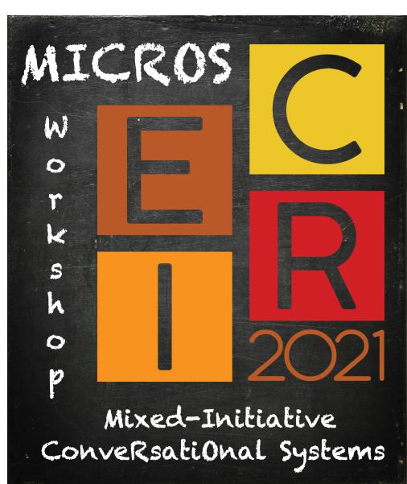

---
  header:
    title: Home
    weight: 1
---

<!--html_preserve-->

<!-- Global site tag (gtag.js) - Google Analytics -->
  
  

<!--/html_preserve-->

<!--  -->

### Overview

The _Mixed-Initiative ConveRsatiOnal Systems workshop (MICROS)_ aims at bringing novel ideas and investigating new solutions on conversational assistant systems. The increasing popularity of personal assistant systems, as well as smartphones, has changed the way users access online information, posing new challenges for information seeking and filtering. MICROS will have a particular focus on mixed-initiative conversational systems, namely, systems that can provide answers in a proactive way (e.g., asking for clarification or proposing possible interpretations for ambiguous and vague requests). We will invite people working on conversational systems or interested in the workshop topics to send us their position and research manuscripts.

<!--The increasing popularity of personal assistant systems and smartphones has drawn attention to conversational systems. Thanks to the recent advances in automatic speech recognition and voice generation, conversational systems are largely employed in smart-home devices (e.g., Google Home, Amazon Alexa) as well as wearable devices (e.g., Apple Siri, Microsoft Cortana, Google Assistant). 

The 2nd Edition of the Workshop on _Mixed-Initiative ConveRsatiOnal Systems_ (MICROS@CIKM2022) aims at investigating and collecting novel ideas and contributions in the field of conversational systems. These systems provide a conversational interface for different tasks ranging from seeking information to performing e-commerce transactions. 

MICROS aims to bring together researchers from academia and industry to discuss the challenges and future of conversational systems. The workshop will have a particular focus on mixed-initiative conversational systems. These proactive systems do not simply provide answers but also propose possible interpretations for ambiguous and vague requests, improving the user's information-seeking experience.

We invite people working on conversational search as well as interactive recommendation to send us their position and research papers. Novel approaches for conversational information seeking that are based on natural language processing and artificial intelligence are also welcome. We encourage submissions on  approaches for conversational search, recommendation, evaluation techniques, data creation and curation, as well as domain-specific applications for conversational systems. The workshop will prioritize innovative and impactful contributions, all the accepted papers will be presented as contribution talks and will have the opportunity to be published in the CEUR proceedings. 
The workshop will also have keynote talks by experienced researchers and a panel discussion to share insights about conversational systems.  -->

Follow us on Twitter: [@microsworkshop](https://twitter.com/microsworkshop)

### Organizers

- Ida Mele (IASI-CNR Rome, IT)
- Cristina Ioana Muntean (ISTI-CNR Pisa, IT)
- Mohammad Aliannejadi (University of Amsterdam, NL)
- Nikos Voskarides (Amazon, Barcelona, ES) 

### Important Dates

Time zone: Anywhere on Earth (AoE)

- <b>September 4, 2022: Paper submission deadline (extended) </b>
- September 15, 2022: Paper acceptance notification
- <b>October 21, 2022: Workshop date</b>

### Registration information

**News:** The CIKM's OC has decided that each accepted paper must have **at least one author with "in-person (non-student) workshop registration"**, even if all the authors will only attend virtually. 

For more information, plase visit the [conference website](https://www.cikm2022.org/) and the [pricing page](https://www.cikm2022.org/pricing). Note that the fee is $225 for ACM/SIGWEB/SIGIR members and $300 for non-members.

### Accepted Papers
- Thomas Beelen, Khiet P. Truong, Roeland Ordelman, Ella Velner, Vanessa Evers and Theo Huibers.   _"A Child-Friendly Approach to Spoken Conversational Search	information on submission."_
  - *Speaker:* Thomas Beelen (virtual presentation)

- Tommaso Di Noia, Francesco M Donini, Dietmar Jannach, Fedelucio Narducci and Claudio Pomo.	  _"Towards a theoretical formalization of conversational recommendation."_
  - *Speaker:*  Claudio Pomo (in-person presentation)

### Keynote Speaker

- **Siva Reddy** 
  - **Short Bio:** Siva Reddy is an Assistant Professor in the School of Computer
Science and Linguistics at McGill University. He is a Facebook CIFAR
AI Chair and a core faculty member of Mila Quebec AI Institute. Before
McGill, he was a postdoctoral researcher at Stanford University. He
received his PhD from the University of Edinburgh in 2017, where he
was a Google PhD Fellow. His research focuses on representation
learning for language that facilitates systematic generalization,
reasoning and conversational modeling. He received the 2020
VentureBeat AI Innovation Award in NLP, and the best paper award at
EMNLP 2021.
  - **Title:** _"Improving trust in conversational models through user feedback and knowledge grounding"_ (virtual presentation) 
  - **Abstract:** Rapid advances in language models have enabled
conversational models to generate fluent and realistic responses.
However, these responses are often hallucinations rather than the
truth, thereby impeding the trust of end users. In this talk, I will
present multiple ways to increase trust: 1) exploiting user
engagements and feedback to enable answer explanations, 2) grounding
responses to evidence in documents and 3) setting expectations of
end-users by revealing the limitations of conversational models. I
will show these paradigms improve trust, and surprisingly, the
accuracy of the responses too.
- [Slides](pubs/Reddy_MICROS2022.pdf)

### Invited Speakers
- **Andrew Yates**
  - **Short Bio:** Andrew Yates is an Assistant Professor at the University of Amsterdam, where he focuses on developing content-based neural ranking methods and leveraging them to improve search and downstream tasks. He has co-authored a variety of papers on neural ranking methods as well as a recent book on transformer-based neural methods: "Pretrained Transformers for Text Ranking: BERT and Beyond". Previously, Andrew was a post-doctoral researcher and then senior researcher at the Max Planck Institute for Informatics. Andrew received his Ph.D. in Computer Science from Georgetown University, where he worked on information retrieval and information extraction in the medical domain.
  - **Title:** _"Zero-shot Query Contextualization for Conversational Search"_ (virtual presentation)
  - **Abstract:** Current conversational passage retrieval systems cast conversational search into ad-hoc search by using an intermediate query resolution step that places the user’s question in context of the conversation. While the proposed methods have proven effective, they still assume the availability of large-scale question resolution and conversational search datasets. To waive the dependency on the availability of such data, we adapt a pre-trained token-level dense retriever on ad-hoc search data to perform conversational search with no additional fine-tuning. The proposed method allows to contextualize the user question within the conversation history, but restrict the matching only between question and potential answer. Our experiments demonstrate the effectiveness of the proposed approach. We also perform an analysis that provides insights of how contextualization works in the latent space, in essence introducing a bias towards salient terms from the conversation.

- **Hideaki Joko** 
  - **Short Bio:** Hideaki Joko is a PhD candidate at Radboud University, Netherlands. He is working on entity-oriented conversational search in his PhD research.
  - **Title:** _"Personal Entity, Concept, and Named Entity Linking in Conversations"_ (in-person presentation)
  - **Abstract:** Building conversational agents that can have natural and knowledge-grounded interactions with humans requires understanding user utterances. Entity Linking (EL) is an effective and widely used method for understanding natural language text and connecting it to external knowledge. It is, however, shown that existing EL methods developed for annotating documents are suboptimal for conversations, where personal entities (e.g., "my cars") and concepts are essential for understanding user utterances. In this paper, we introduce a collection and a tool for entity linking in conversations. We collect EL annotations for 1327 conversational utterances, consisting of links to named entities, concepts, and personal entities. The dataset is used for training our toolkit for conversational entity linking, CREL. Unlike existing EL methods, CREL is developed to identify both named entities and concepts. It also utilizes coreference resolution techniques to identify personal entities and references to the explicit entity mentions in the conversations. We compare CREL with state-of-the-art techniques and show that it outperforms all existing baselines.

- **Ismail Sabei**
  - **Short Bio:** Ismail Sabei is a Ph.D. candidate from the School of ITEE at The University of Queensland under the supervision of Prof. Guido Zucoon. He received his bachelor's degree from King Abdulaziz University, KSA in Computer Science and master's degrees from Queensland University of Technology in Information Technology. His research interests include Information Retrieval and Search in Chat Conversation.
  - **Title:** _"SCC -- A Test Collection for Search in Chat Conversations"_
  - **Abstract:** We present SCC, a test collection for evaluating search in chat conversations. Chat applications such as Slack, WhatsApp and Wechat have become popular communication methods. Typical search requirements in these applications revolve around the task of known item retrieval, i.e. find information that the user has previously experienced in their chats. However, the search capabilities of these chat applications are often very basic. Our collection aims to support new research into building effective methods for chat conversations search. We do so by building a collection with 114 known item retrieval topics for searching over 437,893 Slack chat messages. An important aspect when searching through conversations is the unit of indexing (indexing granularity), e.g., it being a single message vs. an entire conversation. To support researchers to investigate this aspect and its influence on retrieval effectiveness, the collection has been processed with conversation disentanglement methods: these mark cohesive segments in which each conversation consists of messages whose senders interact with each other regarding a specific event or topic. This results in a total of 38,955 multi-participant conversations being contained in the collection. Finally, we also provide a set of baselines with related empirical evaluation, including traditional bag-of-words methods and zero-shot neural methods, at both indexing granularity levels.

### Schedule

The MICROS program is available [here](pubs/MICROS2022_Workshop_Program.pdf)

### Submissions

Papers must be submitted by **(extended deadline) September 4, 2022 (23:59 AoE)** via EasyChair ([Submission Link](https://easychair.org/conferences/?conf=micros2022)).

Submitted papers should be in the ACM two-column conference format. The workshop has a **single-blind** reviewing process, so the submissions can include the name and affiliations of authors.
 

The following paper categories are welcome:
- research papers on novel, original, and unpublished work (pre-prints submitted to ArXiv are eligible). **Max length: 10 pages, plus references**
- extended abstracts summarizing published results or ongoing works/ideas. **Max length: 3 pages, plus references**

All accepted papers will be presented at the workshop. 

### Topics
The workshop topics include but are not limited to:

- Applications of conversational search and recommendation systems
    - Large-scale retrieval candidate responses (e.g., documents, passages) in conversational search
    - Conversational and question-based recommendation systems
    - Tracking information-need evolution during the conversation (e.g., context changes)
    - Processing and rewriting of natural language conversational queries
    - Relevance feedback in conversational search
- Mixed-initiative interaction systems, such as clarification and preference elicitation in conversational systems
     - Dialogue schema for conversational search
    - Conversational navigation of search results
    - Conversation history understanding and query modeling
    - Pro-active search and recommendation interactions in conversational search
- Deep learning and reinforcement learning for conversational search
    - Conversational question answering
    - Result summarization, explanation, and presentation in conversational search
    - Balance and bias for more inclusive conversational systems
- Multi-modal interactions for conversational interfaces (e.g., speech-only and small-screen interfaces)
    - Voice-based search engine operations
    - User intent and dialog state tracking in conversational search
    - Personalization and user models for conversational search
- Specialized applications and use  cases for conversational search (e.g., health, finance, travel)
- Knowledge graph presentation in conversational search
- Data creation and curation for conversational search
- Evaluation metrics for effectiveness, engagement, user satisfaction of conversational systems

### Program committee

- Mikhail Burtsev, MIPT Moscow, RU
- Kai Hui, Amazon Alexa Search, DE
- Antonis Krasakis, University of Amsterdam, NL
- Sean MacAvaney, University of Glasgow, UK
- Franco Maria Nardini, ISTI-CNR Pisa, IT
- Gustavo	Pehna, TU Delf, NL
- Raffaele Perego, ISTI-CNR Pisa, IT
- Fabrizio Silvestri, Sapienza University of Rome, IT
- Damiano Spina, RMIT Melbourne, AU
- Leila	Tavakoli, RMIT University, AU
- Johanne Trippas, RMIT University, AU
- Hamed Zamani, UMass Amherst, USA

